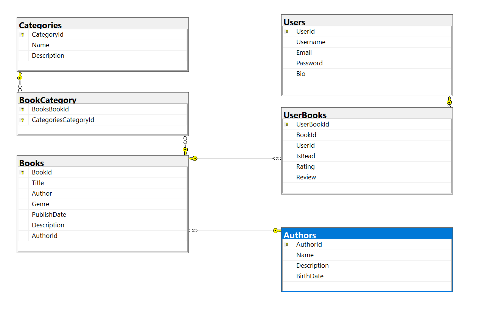

# book-review-app
## Project Proposal - Book Review Application

This web application for book reviews lets users discover, rate, and discuss about books they’ve read. It serves as a virtual community for book enthusiasts to share opinions and recommendations.

### Specifications/Features/Requirements
-	User Accounts: Secure registration and login procedures, profile customization by allowing users to add a short bio and a profile picture.
-	Browse Functionality: A book catalog shall be created and will be accessible via a view called “Browse”.
-	Search Functionality: This functionality shall be inserted in the same “Browse” page and will allow users to search from the whole application catalogue, books based on names and authors.
-	Review and Rating System: Users can leave detailed reviews and star ratings.
-	Summary functionality: Each individual book can be displayed in a different view that shall print information about the book like author, category, publish date and a description.
-	Add functionality: using this mechanism, users could add books they have read or that are interested in.
-	Deployment requirements: The application will be deployed into a docker container having a base image started from either Linux or Windows.
-	The application must run from a virtual machine
-	The database can either be hosted as a service or docker image
-	Other requirements:
	-	Intuitive interface
	-	Logo creation
	-	Each view shall have a background picture
	-	Ensure easy navigation between views
	
### Tools/Technologies/Frameworks that will be used:
1. As an IDE, Visual Studio will be used. As an alternative Visual Studio Code can also be used.
2. The application will be written in C# using ASP.NET framework for the backend (server logic and API management)
3. Being a small application, on the frontend we shall be using HTML/CSS/Bootstrap
4. For database management, MySQL server will be used.
5.
For deployment mechanism, we will be using Docker and Docker Desktop application.
6. For versioning, a GitHub project was created at the following address:
https://github.com/silviu-dumitrescu/book-review-app
7. For diagram creation, we will be using draw.io

